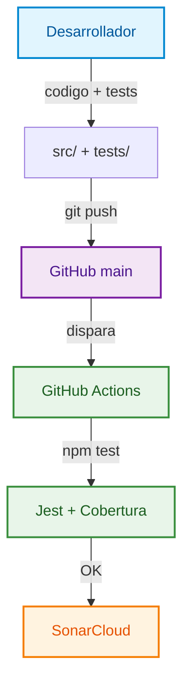

# Coca-Cola DevOps Stock Portal

Proyecto de gestion de inventario para **Coca-Cola** con persistencia en **JSON** y pipeline **CI/CD** con GitHub Actions y SonarCloud.

---

## Estructura del proyecto

```text
producto_software/
├── .githooks/              # Hooks de Git (pre-push ejecuta tests)
├── .github/workflows/      # Pipeline CI/CD
├── docs/                   # Documentacion tecnica
├── scripts/                # Utilidades (instalar hooks)
├── src/                    # Codigo fuente
│   ├── db/                 # Persistencia JSON
│   ├── middleware/
│   ├── routes/
│   ├── validators/
│   └── public/             # Interfaz web
├── tests/                  # Pruebas unitarias e integracion
├── CONTRIBUTING.md
└── README.md
```

Ver detalle en [`docs/architecture.md`](docs/architecture.md).

---

## Como ejecutar en local

Requisito: **Node.js 24** (CI usa Node.js 24).

```bash
npm install
npm start
```

Abre [http://localhost:3000](http://localhost:3000) — la API y la UI se sirven desde el mismo servidor.

### Pruebas

```bash
npm test
npm run coverage
```

### Git hooks (opcional)

```bash
npm run hooks:install
```

---

## Que hace la aplicacion

Portal de **stock en tiempo real** para Coca-Cola:

1. Lista productos con precio y existencias.
2. Permite **agregar productos** al inventario.
3. Permite **dar entrada de stock**.
4. Permite **despachar pedidos** y descontar stock.
5. **Persiste datos** en JSON (`data/inventory.json`).

---

## Cumplimiento DevOps

| Requisito | Ubicacion |
|-----------|-----------|
| GitHub Actions CI | [`.github/workflows/ci.yml`](.github/workflows/ci.yml) |
| SonarCloud | [`sonar-project.properties`](sonar-project.properties) |
| Pruebas automatizadas | [`tests/`](tests/) |
| Git hooks | [`.githooks/pre-push`](.githooks/pre-push) |

### Repositorio

- GitHub: https://github.com/Jsantos2808/COCA-COLA
- Actions: https://github.com/Jsantos2808/COCA-COLA/actions

---

## Flujo de trabajo DevOps



---

## API REST

| Metodo | Endpoint | Descripcion |
|--------|----------|-------------|
| GET | `/api/health` | Estado del servicio |
| GET | `/api/products` | Listar inventario |
| POST | `/api/products` | Crear producto |
| POST | `/api/entries` | Entrada de stock |
| POST | `/api/orders` | Despachar pedido |

Documentacion completa: [`docs/api.md`](docs/api.md).

---

## Evidencia para entrega academica

1. Captura de la estructura del proyecto (`.githooks`, `docs`, `scripts`, `src`, `tests`).
2. Captura de **Actions** con el workflow en verde.
3. Captura del **Quality Gate** en SonarCloud.
4. Captura del portal funcionando en el navegador.
