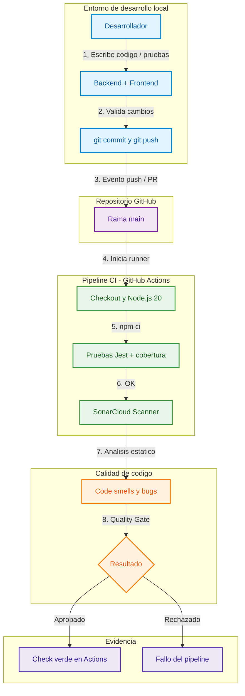

# Coca-Cola DevOps Stock Portal - Pipeline CI/CD

Proyecto de gestión de inventario para Coca-Cola. Resuelve la integración manual y el análisis de seguridad tardío con **pruebas automáticas** y **auditoría continua de código** mediante **GitHub Actions**.

---

## Cumplimiento del requisito: GitHub Actions

Este sistema usa **GitHub Actions** como motor de Integración Continua (CI).

| Elemento | Ubicación / detalle |
|----------|---------------------|
| Workflow | [`.github/workflows/ci.yml`](.github/workflows/ci.yml) |
| Disparadores | `push` y `pull_request` a la rama `main` |
| Job 1 | Instala dependencias, ejecuta **Jest** con cobertura y publica el artefacto |
| Job 2 | Análisis **SonarCloud** (si existe el secreto `SONAR_TOKEN`) |
| Evidencia en GitHub | Pestaña **Actions** del repositorio |

Cada vez que se sube código a `main` (o se abre un PR), GitHub levanta un runner en la nube, clona el repo y ejecuta el pipeline sin intervención manual.

### Cómo activarlo en tu cuenta de GitHub

1. Crea un repositorio vacío en GitHub (por ejemplo `coca-cola-stock-portal`).
2. En esta carpeta (`producto_software`) inicializa Git y súbelo:

```bash
git init
git add .
git commit -m "ci: pipeline GitHub Actions para Stock Portal"
git branch -M main
git remote add origin https://github.com/TU_USUARIO/TU_REPO.git
git push -u origin main
```

3. Entra a tu repo en GitHub → pestaña **Actions**.
4. Debe aparecer el workflow **CI - Coca-Cola Stock Portal** en ejecución (o ya finalizado).
5. Si el check está en verde, el requisito de GitHub Actions queda demostrado.

### (Opcional) SonarCloud

1. Crea un proyecto en [SonarCloud](https://sonarcloud.io) y genera un token.
2. En GitHub: **Settings → Secrets and variables → Actions → New repository secret**.
3. Nombre: `SONAR_TOKEN` · Valor: el token de SonarCloud.
4. El job de análisis se ejecutará en el siguiente push.

Sin ese secreto, el job de pruebas **sigue corriendo** y cumple el requisito de CI con GitHub Actions.

---

## Flujo de trabajo DevOps



---

## Estructura del proyecto

```text
producto_software/
├── .github/workflows/ci.yml   # Pipeline de GitHub Actions
├── backend/                   # API REST (Express + Jest)
│   ├── src/
│   └── tests/
├── frontend/                  # Interfaz web (HTML + Tailwind + JS)
├── sonar-project.properties   # Configuración SonarCloud
└── README.md
```

---

## Cómo ejecutar el sistema en local

Requisito: **Node.js 18+**.

### Backend (API en el puerto 3000)

```bash
cd backend
npm install
npm start
```

Endpoints:

- `GET /api/health` — estado del servicio
- `GET /api/products` — inventario
- `POST /api/orders` — cuerpo `{ "productId": 1, "quantity": 2 }`

### Frontend (UI)

En otra terminal:

```bash
cd frontend
npx serve -l 5500
```

Abre [http://localhost:5500](http://localhost:5500). La UI consume la API en `http://localhost:3000`.

### Pruebas unitarias (las mismas que corre Actions)

```bash
cd backend
npm test
npm run coverage
```

---

## Qué hace la aplicación

Portal de **stock en tiempo real**:

1. Lista productos Coca-Cola / Sprite con precio y existencias.
2. Permite **despachar pedidos** y descontar stock.
3. Valida datos inválidos y stock insuficiente en la API.

---

## Evidencia sugerida para la entrega académica

1. Captura de la pestaña **Actions** con el workflow en verde.
2. Detalle del job mostrando `npm ci` y `npm test`.
3. (Opcional) Captura del Quality Gate en SonarCloud.
4. Enlace al repositorio público o privado compartido con el docente.
