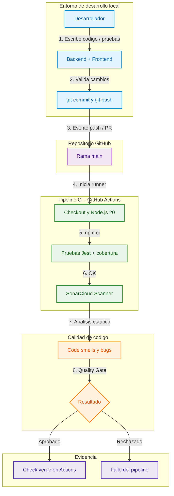

# Coca-Cola DevOps Stock Portal - Pipeline CI/CD

Proyecto de gestión de inventario para Coca-Cola. Resuelve la integración manual y el análisis de seguridad tardío con **pruebas automáticas** y **auditoría continua de código** mediante **GitHub Actions**.

---

## Cumplimiento del requisito: GitHub Actions

Este sistema usa **GitHub Actions** como motor de Integración Continua (CI).

| Elemento | Ubicación / detalle |
|----------|---------------------|
| Workflow | [`.github/workflows/ci.yml`](.github/workflows/ci.yml) |
| Disparadores | `push` y `pull_request` a la rama `main` |
| Job principal | Instala dependencias, ejecuta **Jest** con cobertura y analiza con **SonarQube Cloud** |
| Evidencia en GitHub | Pestaña **Actions** del repositorio |
| Evidencia Sonar | Dashboard del proyecto en [SonarCloud](https://sonarcloud.io) |

Cada vez que se sube código a `main` (o se abre un PR), GitHub levanta un runner en la nube, clona el repo y ejecuta el pipeline sin intervención manual.

### Repositorio del proyecto

- GitHub: https://github.com/Jsantos2808/COCA-COLA
- Actions: https://github.com/Jsantos2808/COCA-COLA/actions

---

## Cumplimiento del requisito: SonarQube

Se usa **SonarQube Cloud** (SonarCloud): el mismo motor de SonarQube en la nube, integrado con GitHub Actions. Analiza bugs, code smells, vulnerabilidades y cobertura en cada push.

| Elemento | Detalle |
|----------|---------|
| Configuración | [`sonar-project.properties`](sonar-project.properties) |
| Paso en CI | Escaneo SonarCloud dentro de [`.github/workflows/ci.yml`](.github/workflows/ci.yml) |
| Autenticación | Secreto de GitHub `SONAR_TOKEN` |

### Pasos para activar SonarQube Cloud (una sola vez)

1. Entra a https://sonarcloud.io e inicia sesión con **GitHub** (cuenta `Jsantos2808`).
2. Crea / elige una **Organization** (anota el **Organization Key**).
3. **Analyze new project** → importa el repo `Jsantos2808/COCA-COLA`.
4. Elige análisis con **GitHub Actions** (no Automatic Analysis).
5. Copia el **Project Key** que te muestre (suele ser `Jsantos2808_COCA-COLA`).
6. Genera un token: avatar → **My Account → Security → Generate Token**.
7. En GitHub → repo **COCA-COLA** → **Settings → Secrets and variables → Actions**:
   - Nombre: `SONAR_TOKEN`
   - Valor: el token generado
8. Actualiza en `sonar-project.properties` la línea `sonar.organization=` con tu Organization Key.
9. Haz `git push` a `main` y verifica:
   - En **Actions**: el paso "Escaneo de calidad SonarCloud" en verde
   - En **SonarCloud**: el dashboard del proyecto con el Quality Gate

---

## Flujo de trabajo DevOps



---

## Estructura del proyecto

```text
producto_software/
├── .github/workflows/ci.yml   # Pipeline de GitHub Actions
├── backend/                   # API REST (Express + Jest)
│   ├── src/
│   └── tests/
├── frontend/                  # Interfaz web (HTML + Tailwind + JS)
├── sonar-project.properties   # Configuración SonarCloud
└── README.md
```

---

## Cómo ejecutar el sistema en local

Requisito: **Node.js 18+**.

### Backend (API en el puerto 3000)

```bash
cd backend
npm install
npm start
```

Endpoints:

- `GET /api/health` — estado del servicio
- `GET /api/products` — inventario
- `POST /api/orders` — cuerpo `{ "productId": 1, "quantity": 2 }`

### Frontend (UI)

En otra terminal:

```bash
cd frontend
npx serve -l 5500
```

Abre [http://localhost:5500](http://localhost:5500). La UI consume la API en `http://localhost:3000`.

### Pruebas unitarias (las mismas que corre Actions)

```bash
cd backend
npm test
npm run coverage
```

---

## Qué hace la aplicación

Portal de **stock en tiempo real**:

1. Lista productos Coca-Cola / Sprite con precio y existencias.
2. Permite **despachar pedidos** y descontar stock.
3. Valida datos inválidos y stock insuficiente en la API.

---

## Evidencia sugerida para la entrega académica

1. Captura de la pestaña **Actions** con el workflow en verde.
2. Detalle del job mostrando `npm ci`, `npm test` y el escaneo **SonarCloud**.
3. Captura del **Quality Gate** / dashboard en SonarCloud.
4. Enlace al repositorio: https://github.com/Jsantos2808/COCA-COLA
