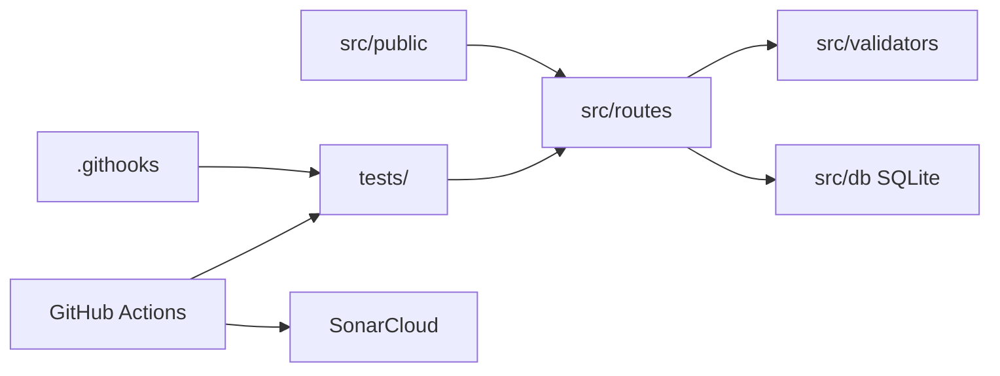

# Arquitectura del proyecto

Este repositorio separa codigo, pruebas, automatizacion y documentacion.

```text
producto_software/
├── .githooks/          # Hooks de Git versionados (pre-push)
├── .github/workflows/  # Pipeline CI/CD (GitHub Actions)
├── docs/               # Documentacion tecnica
├── scripts/            # Utilidades de desarrollo
├── src/                # Codigo fuente de la aplicacion
│   ├── db/             # Capa de persistencia SQLite
│   ├── middleware/     # Middleware Express
│   ├── routes/         # Rutas de la API REST
│   ├── validators/     # Validaciones de negocio
│   └── public/         # Interfaz web estatica
├── tests/              # Pruebas unitarias e integracion
├── package.json
├── CONTRIBUTING.md
└── README.md
```

## Capas

| Carpeta | Responsabilidad |
|---------|-----------------|
| `src/` | Logica de negocio, API REST y UI |
| `tests/` | Pruebas Jest independientes del codigo fuente |
| `scripts/` | Instalacion de hooks y tareas de soporte |
| `.githooks/` | Validaciones locales antes de push |
| `docs/` | Arquitectura, API y guias |

## Flujo de datos



## Persistencia

Los datos se almacenan en SQLite (`data/inventory.db`). En pruebas se usa base de datos en memoria (`:memory:`).
